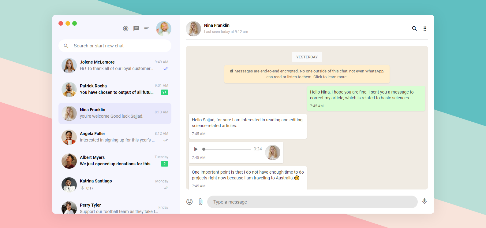

# Whatsapp web (clone)

 

Whatsapp today needs to change a bit. I was interested in changing this social network a bit. Click [here](https://sajjadpaknia.github.io/Whatsapp-web-clone---HTML---CSS/) to see the demo.

### Technologies

Html - Css

### Contributing
If you are interested, you can make changes on this project and if you have any criticism or suggestion, be sure to let me know. Thanks

### License
[MIT](https://choosealicense.com/licenses/mit/)
